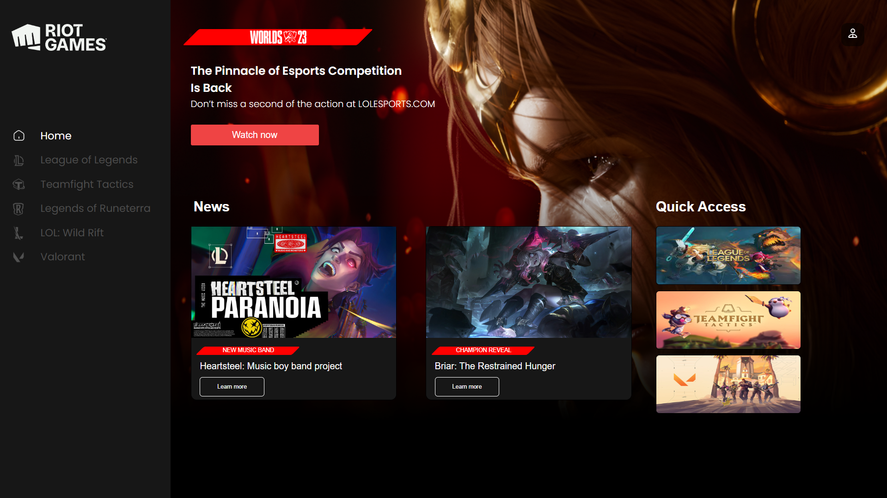
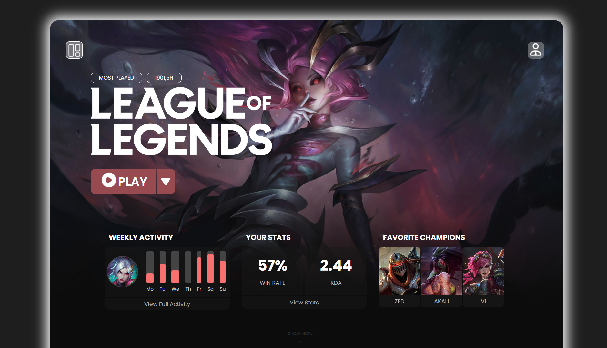
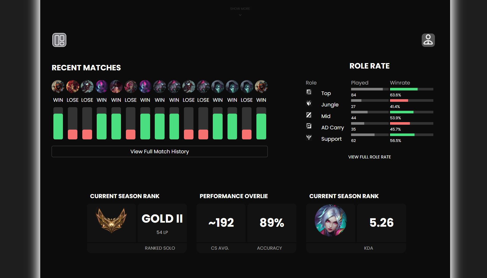

├── pages/  
    ├── css/  
    │ ├── login.css  
    │ ├── signup.css  
    │ ├── mainpage.css  
    │ ├── lol.css  
    │ ├── teamfight.css  
    │ ├── valo.css  
    │ └── for-future-features.css  
    ├── js/  
    │ ├── login.js  
    │ ├── signup.js  
    │ ├── mainpage.js  
    │ ├── lol.js  
    │ ├── teamfight.js  
    │ ├── valo.js  
    │ └── for-future-features.js  


# 🎮 Riot Games Website Clone — Vanilla HTML, CSS & JS

Этот проект — вёрстка сайта в стиле **Riot Games**, реализованная на чистом **HTML, CSS и JavaScript** (без фреймворков). Проект имитирует интерфейс Riot, включая страницы популярных игр и пользовательскую аутентификацию.

---

## 📄 Структура проекта

Проект состоит из набора HTML-страниц и связанных с ними CSS/JS-файлов. Ниже — описание каждой из них:

### 🔐 Аутентификация
| Файл | Назначение |
|------|------------|
| `signup.html` | Страница регистрации нового пользователя |
| `login.html` | Страница входа в систему |

### 🏠 Основная навигация
| Файл | Назначение |
|------|------------|
| `mainpage.html` | Домашняя страница после входа. Содержит ссылки на игровые страницы |

### 🕹️ Страницы игр
| Файл | Игра |
|------|------|
| `lol.html` | **League of Legends** |
| `teamfight.html` | **Teamfight Tactics** |
| `valo.html` | **Valorant** |

Каждая из этих страниц отображает характеристики игрока (напр. имя, уровень, любимый персонаж), которые могли быть введены при регистрации.

### 🔧 Дополнения и ошибки
| Файл | Назначение |
|------|------------|
| `for-future-features.html` | Страница-заглушка **404** — для будущих функций и ссылок |

---

## 🖼️ Примеры страниц


<h3>🔐 Страница входа</h3>


<h3>🔐 Страница регистрации</h3>


<h3>🏠 Главная страница</h3>


<h3>🎮 League of Legends</h3>


<h3>🎮 Statistics</h3>

---

## 🎨 Стили и скрипты

Каждая HTML-страница имеет свои собственные CSS и JS-файлы с тем же названием:


Скрипты управляют базовыми функциями, такими как:

- Проверка форм регистрации/входа
- Персонализация страницы пользователя
- Навигация между страницами
- Эффекты интерфейса и интерактивные элементы

---

## 📸 Превью (Screenshots)

> _Здесь можно вставить скриншоты страниц: login, mainpage, lol и т.д._

---

## ⚙️ Как запустить

1. Склонируй репозиторий:
   ```bash
   git clone https://github.com/HayaKawaRin/website_layout-riot_games.git
   cd website_layout-riot_games
